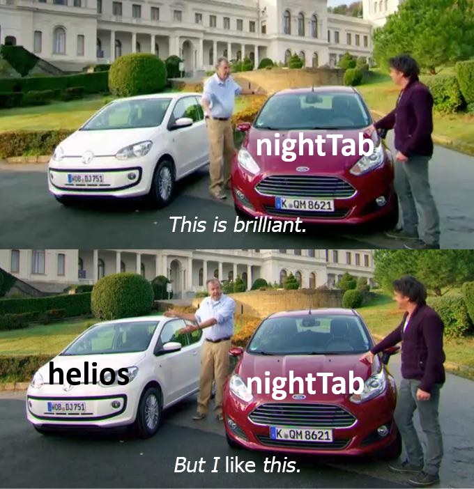
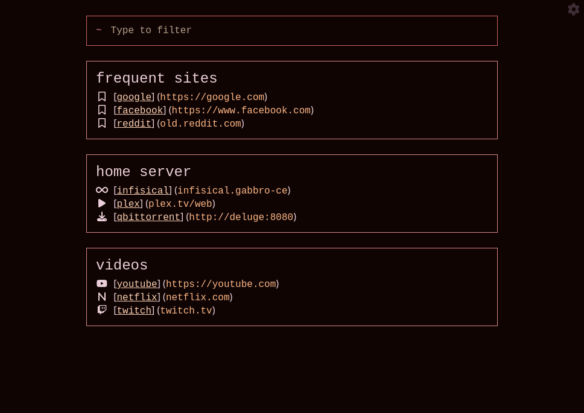

<div align="center">

  # helios

A start page built with Python, htmx and Hyperscript.




</div>

As much as I love nightTab, I had a few problems with it:

1. It doesn't sync across devices
2. It becomes very tedious to add / edit many bookmarks at once. I do this every now and then when changing domain names on my home server. I end up having to repeat a lot of actions in the UI and it sometimes chugs a bit when I have many bookmarks.
3. The configuration file is huge. It's much larger and complex than I need it to be. I don't need individual styling for every bookmark, I don't need to store colors as both rgb and hsl, etc. I want to be able to manually read and edit the data file when neccessary.

So I created helios to address these problems. It sacrifices customization for simplicity. It's fast, the data file is very small, and it's hosted, so there's no worrying about synchronization. 

<div align="center">
  
# Screenshots



</div>

<div align="center">

# Development

</div>

Use the development docker compose file.

```bash
docker compose -f docker-compose.dev.yml up
```
